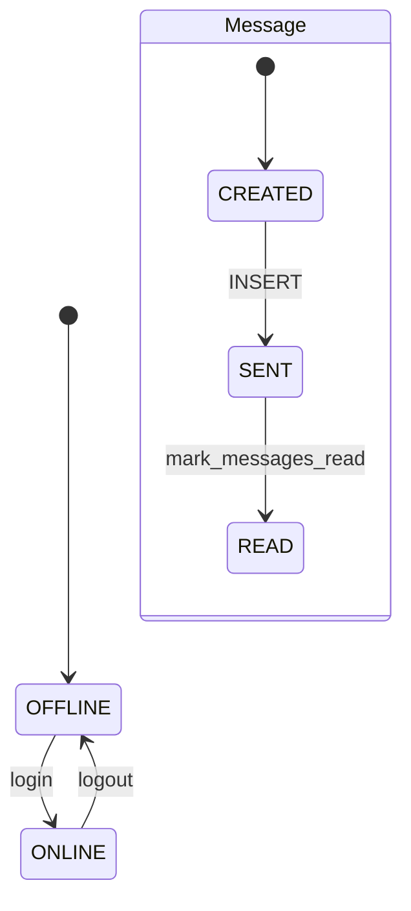

# SST — State Specification Template
**Type:** Internal Dynamic | **Telegram Web Clone**

## Purpose
Describes entity lifecycle, state transitions, and session changes inside the backend.

---

## 1. User Session State

```
OFFLINE ──login──► ONLINE ──logout──► OFFLINE
```

| Transition | Trigger | DB Change |
|------------|---------|-----------|
| OFFLINE → ONLINE | `POST /auth/login` | `users.online = 1`, `last_seen = now` |
| ONLINE → OFFLINE | `POST /auth/logout` | `users.online = 0`, `last_seen = now` |

**Implementation:** `sst/state_manager.py` → `StateManager.apply_login()` / `apply_logout()`

---

## 2. Message Lifecycle State

```
CREATED ──persist──► SENT ──recipient opens chat──► READ
```

| State | Condition |
|-------|-----------|
| CREATED | Message object built, not yet saved |
| SENT | Row exists in `messages` table |
| READ | `messages.is_read = 1` for recipient's view |

**Read transition:** When user calls `GET /api/chats/{id}/messages`, all messages from other senders are marked read:
```sql
UPDATE messages SET is_read = 1
WHERE chat_id = ? AND sender_id <> ? AND is_read = 0
```

---

## 3. Chat Membership State

| State | Rule |
|-------|------|
| MEMBER | Row in `chat_members` for `(chat_id, user_id)` |
| NON_MEMBER | No row — API returns 403 |

**Guard:** `StateManager.ensure_member()` before messages/members access.

---

## 4. Database Entity States

### users
| Field | State meaning |
|-------|---------------|
| `online` | 0 = offline, 1 = online |
| `last_seen` | Last login/logout timestamp |

### messages
| Field | State meaning |
|-------|---------------|
| `is_read` | 0 = unread for other members, 1 = read |

---

## State Diagram


