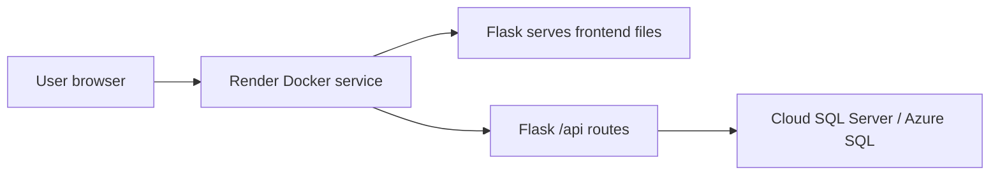

# Deployment Guide

This repo can be deployed from GitHub as a full-stack application. In production, the Flask service serves both the frontend files and the `/api` routes from one URL.

## Important Hosting Note

GitHub Pages can serve `frontend/` because it is static HTML, CSS, and JavaScript. It cannot run the Flask backend. Keep GitHub as the source repository, then connect the repo to a Docker-capable host such as Render for the full-stack deployment.

Recommended setup:

| Layer | Host |
| --- | --- |
| Frontend | Same Render Docker web service |
| Backend | Same Render Docker web service |
| Database | Cloud SQL Server/Azure SQL |

## Architecture



## Backend Deployment

The app is containerized by `backend/Dockerfile`. The Docker image installs production Python dependencies from `backend/requirements-prod.txt`, installs Microsoft ODBC Driver 18 for SQL Server, copies `frontend/` into the image, initializes the schema/demo data once, then runs:

```text
python start_production.py && gunicorn --bind 0.0.0.0:${PORT:-3000} --workers 2 --threads 4 --timeout 120 wsgi:app
```

Render can create the service from `render.yaml`.

Required backend environment variables:

| Variable | Example | Notes |
| --- | --- | --- |
| `SQL_SERVER` | `your-server.database.windows.net,1433` | Cloud SQL Server host |
| `DB_NAME` | `TelegramClone` | Database must already exist when `SKIP_DATABASE_CREATE=true` |
| `SQL_USER` | `telegram_admin` | SQL auth user |
| `SQL_PASSWORD` | `strong-password` | Store only in host secrets |
| `SKIP_DATABASE_CREATE` | `true` | Recommended for hosted SQL |
| `JWT_SECRET` | generated secret | Render can generate it from `render.yaml` |
| `SERVE_FRONTEND` | `true` | Makes Flask serve `frontend/index.html` and assets |
| `FRONTEND_DIR` | `/app/frontend` | Set by Docker/Render config |
| `CORS_ORIGINS` | `https://saadh472.github.io` | Allows GitHub Pages frontend |
| `ODBC_ENCRYPT` | `yes` | Required by most cloud SQL providers |
| `ODBC_TRUST_CERT` | `yes` | Keep `yes` unless your SQL provider validates cleanly with `no` |

Health check:

```text
https://your-backend-host/api/health
```

App URL:

```text
https://your-backend-host/
```

## Optional GitHub Pages Frontend

The main full-stack deployment does not require GitHub Pages. If you still want a static-only frontend on GitHub Pages, the workflow lives at:

```text
.github/workflows/deploy-pages.yml
```

Before running it, add this GitHub repository variable:

| Variable | Example |
| --- | --- |
| `API_BASE_URL` | `https://telegram-clone-api.onrender.com/api` |

GitHub path:

```text
Repository Settings -> Secrets and variables -> Actions -> Variables -> New repository variable
```

Then enable GitHub Pages:

```text
Repository Settings -> Pages -> Source: GitHub Actions
```

Run the workflow:

```text
Actions -> Deploy Frontend to GitHub Pages -> Run workflow
```

Expected frontend URL:

```text
https://saadh472.github.io/telegram-clone/
```

## Local Deployment Override

For quick testing without changing GitHub variables, use the query-string API override:

```text
https://saadh472.github.io/telegram-clone/?api=https://your-backend-host/api
```

## Local Development Still Works

No local workflow changed:

```bat
copy backend\.env.example backend\.env
start.cmd
```

Local SQL Server Windows Authentication still works when `SQL_USER` and `SQL_PASSWORD` are empty.

## Deployment Checklist

- Backend service is healthy at `/api/health`.
- Backend `CORS_ORIGINS` includes `https://saadh472.github.io`.
- GitHub repository variable `API_BASE_URL` includes `/api`.
- GitHub Pages source is set to GitHub Actions.
- Demo login works from the GitHub Pages URL.
