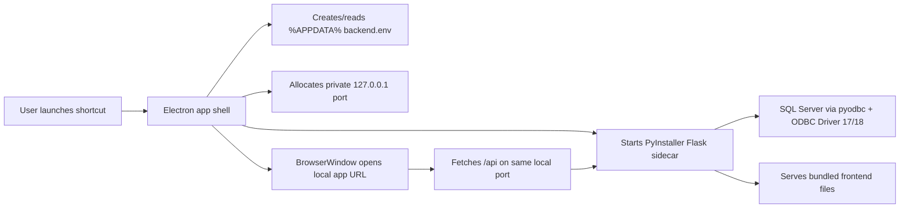

# Telegram Web Desktop Release Guide

## Recommended Approach

Use **Electron + PyInstaller + electron-builder (NSIS)**.

| Option | Fit | Decision |
| --- | --- | --- |
| Tauri | Small runtime and good native packaging, but requires Rust toolchain and sidecar setup. | Not chosen for this Windows-first project because it adds Rust complexity. |
| Electron | Mature Windows installer, shortcuts, updater support, strong static HTML/JS compatibility. | Chosen. Best ROI for current vanilla frontend. |
| PyInstaller only | Good for bundling Flask, weak for a polished web UI shell and installer UX. | Used only for backend sidecar. |
| Native Python wrappers | Possible with pywebview, but installer/update ecosystem is less complete. | Not chosen. |

## Architecture



## Runtime Startup Flow

1. `desktop/electron/main.js` starts.
2. A writable config file is created at:
   `%APPDATA%\Telegram Web Desktop\backend.env`
3. Electron picks a free local port on `127.0.0.1`.
4. Electron starts `telegram_backend.exe` with:
   - `FLASK_HOST=127.0.0.1`
   - `FLASK_PORT=<allocated-port>`
   - `TELEGRAM_DESKTOP_ENV=<backend.env path>`
5. The backend initializes SQL Server schema/seed data.
6. Electron polls `/api/health`.
7. When healthy, Electron opens:
   `http://127.0.0.1:<port>/index.html?desktop=1&api=http%3A%2F%2F127.0.0.1%3A<port>%2Fapi`

## SQL Server Dependency Handling

The installer does **not** silently install SQL Server or Microsoft ODBC drivers. Those are external Microsoft dependencies and may require admin approval/EULA acceptance.

Required on user machines:

- SQL Server Express or an accessible SQL Server instance
- Microsoft ODBC Driver 17 or 18 for SQL Server
- Windows Authentication permission for the current user

If startup fails, the app shows a clean error page and exposes:

- `File -> Open Backend Config`
- `File -> Open Logs Folder`

Users can edit `SQL_SERVER` in `backend.env`, then restart the app.

## Exact Commands

Install build dependencies:

```powershell
npm install
npm --prefix frontend install
python -m pip install -r backend\requirements.txt pyinstaller
```

Run frontend module checks:

```powershell
npm run check
```

Build only the Flask sidecar:

```powershell
npm run desktop:build-backend
```

Install or repair the Electron Windows runtime cache:

```powershell
npm run desktop:install-electron
```

If GitHub downloads are slow in your region, use a mirror:

```powershell
$env:ELECTRON_MIRROR = "https://npmmirror.com/mirrors/electron/"
$env:ELECTRON_BUILDER_BINARIES_MIRROR = "https://npmmirror.com/mirrors/electron-builder-binaries/"
npm run desktop:install-electron
```

Keep those environment variables set for `npm run desktop:release` if NSIS or Windows signing tooling downloads slowly.

Create an unpacked desktop build:

```powershell
npm run desktop:pack
```

Create the distributable Windows installer:

```powershell
npm run desktop:dist
```

Full release script:

```powershell
powershell -NoProfile -ExecutionPolicy Bypass -File scripts\build-installer.ps1
```

## Output

The installer is generated in:

```text
release\Telegram Web Desktop-1.0.0-Setup.exe
```

The installer creates:

- Desktop shortcut
- Start Menu shortcut
- Clean uninstall entry
- Bundled Electron app
- Bundled Flask backend executable
- Custom icon

The build config points `electron-builder` at `node_modules/electron/dist` via `electronDist`, so the release build uses the verified local Electron runtime installed by `scripts\install-electron-runtime.ps1` instead of starting a second runtime download.

## Files Added

```text
package.json
desktop/
  assets/
    icon.ico
    icon.png
  electron/
    main.js
    loading.html
    error.html
scripts/
  build-backend.ps1
  install-electron-runtime.ps1
  build-installer.ps1
docs/
  DESKTOP_RELEASE.md
```

## Files Modified

```text
backend/config.py
backend/requirements.txt
frontend/js/config.js
frontend/js/models/apiModel.js
.gitignore
```

## Versioning Strategy

Use SemVer in root `package.json`:

- Patch: bug fixes and UI polish
- Minor: backward-compatible features
- Major: incompatible database/API changes

Before each installer build:

```powershell
npm version patch
npm run desktop:dist
```

## Auto-Update Readiness

The `electron-builder` config already includes a generic update provider placeholder:

```json
"publish": [
  {
    "provider": "generic",
    "url": "https://example.com/telegram-web-desktop/updates/"
  }
]
```

To activate updates later:

1. Host installer artifacts and update metadata on HTTPS storage.
2. Replace the placeholder URL.
3. Add `electron-updater`.
4. Check for updates after startup.

This keeps the current installer production-ready without forcing update infrastructure now.
